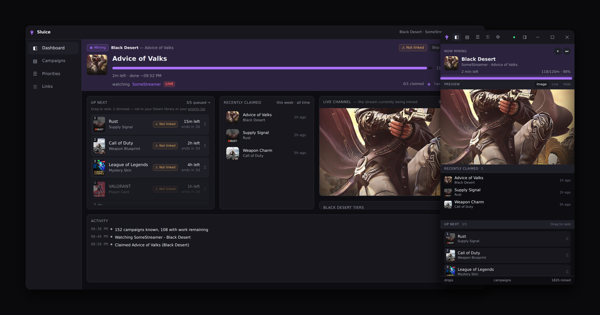

# Sluice

A Twitch drop miner for Windows. It watches the campaigns you can actually earn, claims the
drops as they land, and stays out of the way while it does it.

**[Download the latest version](https://github.com/loversama/sluice-releases/releases/latest)**
— run the installer, sign in to Twitch, and leave it running. It installs for you alone and
never asks for administrator.

Two layouts from one app: a full dashboard, and a slim panel you can leave down the side of
a monitor while you get on with something else.

## What it does

**Mines, and tells you it is mining**

- Works through the campaigns you can earn, ranked how you like — ending soonest, tightest
  deadline, one game at a time, or by what you actually play on Steam.
- Claims each drop the moment it is earned and moves to the next without being asked.
- Shows the channel it is watching, the progress on the current drop, and the watch beat
  Twitch is counting, so you can see it working rather than hope.
- Says plainly when there is nothing to mine, and which of the reasons it is — everything
  claimed, nothing matching your settings, nothing running on Twitch, or nobody streaming
  it — then starts again on its own when that changes.

**Mines what you want**

- Limit it to games you own on Steam. Link Steam by signing in or by pasting your profile
  URL; you never need an API key.
- Name games you want regardless, and exclude ones you never do.
- Drag the queue to reorder it. That order is remembered, and kept separate from your
  priority list, so ranking something for today does not adopt it forever.
- Pause, or skip to the next campaign, from either layout.

**Worth knowing before it costs you a reward**

- Warns before unclaimed progress on an unlinked campaign expires, and shows which publisher
  accounts are worth linking.
- Ranks campaigns whose reward cannot be delivered below ones that can.
- Notices when another copy is mining the same Twitch account — which Twitch allows, and
  silently only credits once.

**Runs while you are not looking**

- Starts with Windows, into the tray, and keeps mining when you close the window.
- A schedule, so it only mines during hours you choose.
- A daily limit on mining hours, with half an hour of latitude to finish a drop in progress.
- Notifications when a drop is claimed or a campaign finishes, carrying the reward's
  artwork, with sounds you can turn off. Telegram and Discord too, if you want them.
- Updates itself, and shows what changed.

## Requirements

Windows 10 or 11. Nothing else — no browser, no runtime to install, no account beyond the
Twitch one you already have.

## Something wrong?

Open an issue on the [main repository](https://github.com/loversama/sluice/issues).
